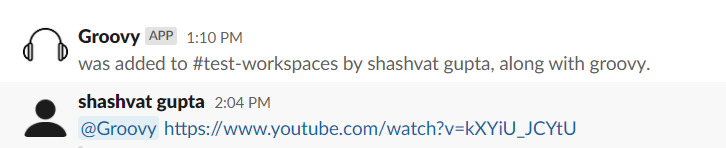

# Groovy-Slack[WIP]
A Slack based website to create playlist of your favourite songs. 
Use this app to make a playlist of your favourite songs or other commercial video links when entered in the Slack channel.

## How to use the app

Call your app with the link you want to add it to a playlist

## How it works
We have created a Django based API to accept POST request from Slack API which stores the link in a database.
The frontend is a ReactJS app which parses all the link entries from the API.

## To Contribute
Join the [Slack](https://join.slack.com/t/newworkspace-gcm9095/shared_invite/zt-jfxca33a-N~LEfMnYEr0F3F5t~ILC2g) Channel to contribute.
